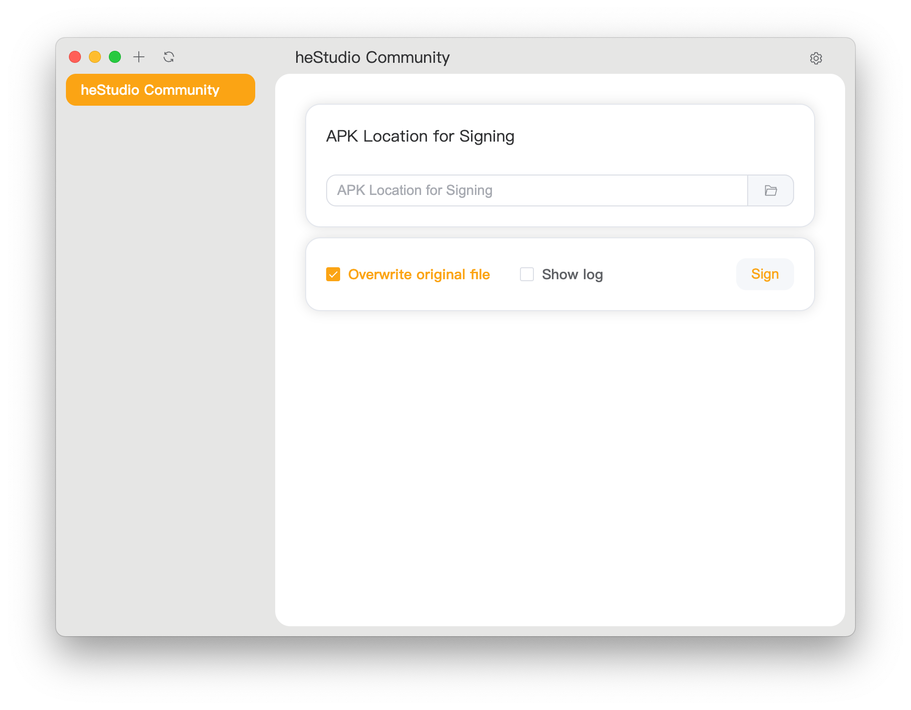
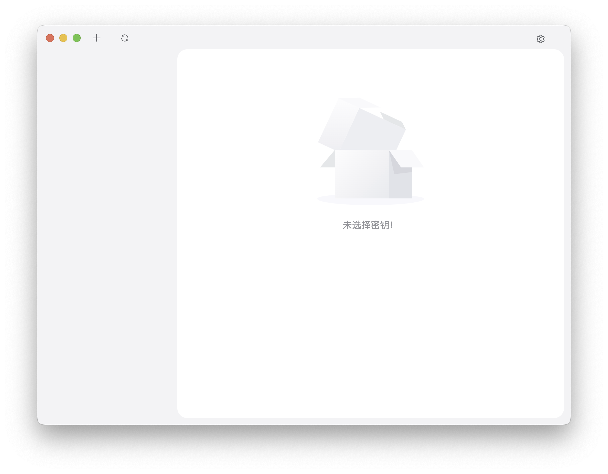
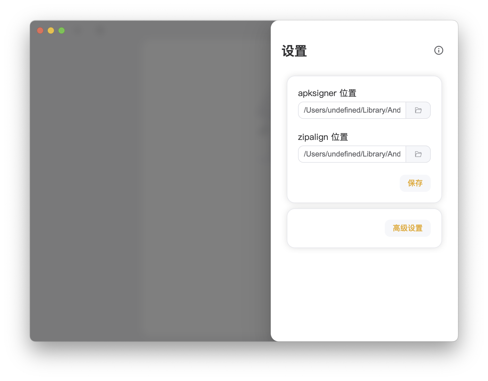
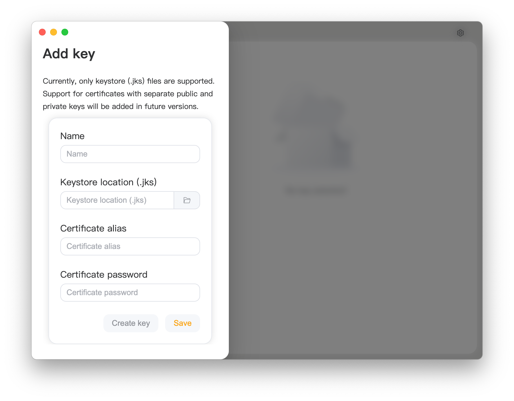

   
   <h1 style="text-align: center">APKSignerGUI</h1>
   
   
简单又完整的APK签名图形化工具

---

### 特点

- **上手简单**: 面向小白用户，只需要导 APK 就可以直接签名。
- **功能完整**: 面向资深用户，提供了谷歌官方提供的所有签名参数支持。
- **兼容性好**: 支持多种操作系统和架构，包括 Windows、Linux、MacOS 等。
- **饼画的圆**: 初期项目，有许多不完善的地方，给大佬们留下足够的扩展空间。

### 关于兼容性

已知支持的平台 (由官方打包并经过测试)：

- **Windows**: Windows 10/11 x86_64 (其中 Windows10 为最新版本), Windows 10/11 ARM64 (其中 Windows10 为最新版本)
- **Linux**: Debian 12 及其衍生版本 x86_64 和 ARM64 平台， RedHat 9.5 及其衍生版本 x86_64 和 ARM64 平台
- **macOS**: 所有采用了 Apple Silicon 的 macOS 10.11 以上设备

可能可用的平台 (可以通过官方的安装包安装，但是不保证能用):

- **Windows**: Windows 7 以及更高版本的 x86_64 平台
- **Linux**:
  - Ubuntu 14.04 或更高版本
  - Fedora 24 或更高版本
  - Debian 8 或更高版本

其他的平台可能需要你自行编译。

#### 为什么不支持 32 位系统或处理器？

我们认为 32 位系统已经落伍，甚至已经无法维持基本的运作了。很多系统厂商和软件厂商不再提供 32 位应用程序和系统。我们认为你几乎不可能在 32 位系统上完成软件开发，因为很多开发工具或者面向对象已经不支持 32 位系统。如果你仍然使用 32 位系统，我们认为你应该可以通过自己的力量使得这个应用程序运作。

### 如何使用？

1. 打开应用程序后，你应该能看到这样的界面。点击右上角设置开始首次配置。
   
2. 在 `sdk/build-tools/<版本号>`目录中找到 `apksigner` 和 `zipalign`, 然后点击保存。
   
3. 点击左侧空白区域关闭设置，然后点击左上角 `+` 添加密钥。
   
4. 点击右侧空白区域关闭页面，选中左侧的签名，然后开始签名安装包。
   

### 如何构建？

1. 安装 nodejs 22
2. 使用 `npm install` 安装依赖。
3. 使用 `npm run make` 构建。
4. 在 `./out/make` 目录中取得构建物。
