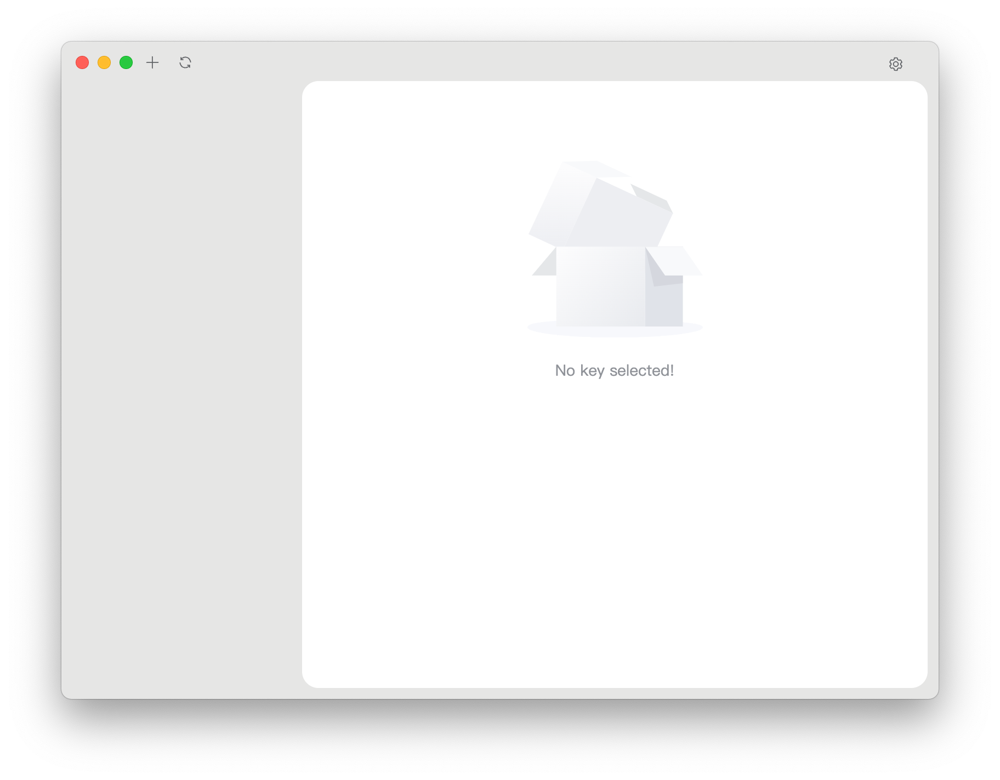

<div align="center">
   
   <h1 style="text-align: center">APKSignerGUI</h1>
   
   <p style="text-align: center">A simple yet complete graphical tool for APK signing</p>
</div>

---

<div align="center">
   <a href="./README.md">English</a> | 
   <a href="./i18n/README/README_CN.md">简体中文</a> | 
   <a href="./i18n/README/README_HK.md">繁體中文</a>
</div>

---

### Features

- **Easy to Use**: Designed for beginners, you only need to import an APK to sign it.
- **Fully Functional**: For advanced users, it supports all signing parameters provided by Google.
- **High Compatibility**: Supports multiple operating systems and architectures, including Windows, Linux, and macOS.
- **Well-structured for Expansion**: As an early-stage project, there is plenty of room for enhancement by experienced developers.

### How to Install

1. Go to [Release](https://github.com/hestudio-community/apksigner-gui/releases/latest) and download the latest version.
2. Windows users can install it via [WinGet](https://learn.microsoft.com/en-us/windows/package-manager/winget/):
   ```powershell
   winget install "heStudioCommunity.APKSignerGUI(Machine-MSI)"
   ```
   
   Of course, you can also download it from the Microsoft Store, which is currently only available for `amd64`.

   <a href="https://apps.microsoft.com/detail/9n3q8bk8dp86?mode=direct">
   
   </a>
3. Build it using the method described at the end of this document.

### Compatibility

Supported platforms (officially packaged and tested):

- **Windows**: Windows 10/11 x86_64 (latest version of Windows 10), Windows 10/11 ARM64 (latest version of Windows 10)
- **Linux**: Debian 12 and its derivatives on x86_64 and ARM64 platforms, RedHat 9.5 and its derivatives on x86_64 and ARM64 platforms
- **macOS**: All macOS 10.11+ devices with Apple Silicon

Other platforms may require manual compilation.

#### Why Not Support 32-bit Systems or Processors?

We believe 32-bit systems are outdated and struggle to maintain basic operations. Many system and software vendors have stopped providing 32-bit applications and systems. It is nearly impossible to perform software development on a 32-bit system since many development tools and target platforms no longer support it. If you still use a 32-bit system, we believe you should have the capability to make this application work by yourself.

### How to Use?

1. After opening the application, you should see this interface. Click the settings icon in the top right to begin initial configuration.
   
2. Locate `apksigner` and `zipalign` in the `sdk/build-tools/<version>` directory, then click save.
   
3. Click the blank area on the left to close the settings, then click `+` in the top left to add a key.
   
4. Click the blank area on the right to close the page, select the signature option on the left, and start signing the package.
   

### Find Your Language

[](https://crowdin.com/project/apksignergui)

We strive to provide the same service and experience to users worldwide. If you're willing to contribute translations to this project, we sincerely appreciate your help.

You can submit translations in two ways:

- Submit translations via the [Crowdin](https://crowdin.com/project/apksignergui) platform.
- Edit and submit translations in the `i18n` directory of the source code.

Didn't find your language? You can submit it in two ways:

- If using [Crowdin](https://crowdin.com/project/apksignergui), submit an issue, and we will add the language for you to translate.
- Alternatively, copy an existing language file from the `i18n` directory, translate it, and submit it. We will handle the rest.

We follow the [ISO 639-1](https://en.wikipedia.org/wiki/ISO_639-1) standard for language codes and [ISO 3166-1](https://en.wikipedia.org/wiki/ISO_3166-1) for country or region codes.

### How to Build?

1. Install [NodeJS 22 LTS](https://nodejs.org/)
2. Install dependencies using `npm install`.
3. Run `npm run make` to build.
4. The built files can be found in the `./out/make` directory.

#### macOS

1. Install [NodeJS 22 LTS](https://nodejs.org/)
2. Install dependencies using `npm install`.
3. Run `npm run make` to build.
4. The built files can be found in the `./out/make` directory.

#### Windows

##### ZIP Packaging (Recommended)

1. Install [NodeJS 22 LTS](https://nodejs.org/)
2. Install dependencies using `npm install`.
3. Edit `forge.config.js`:
   Replace:
   ```javascript
   {
      name: "@electron-forge/maker-wix",
      config: {
        // ...
      },
      platform: ["win32"],
   },
   ```
   with:
   ```javascript
   {
     name: "@electron-forge/maker-zip",
     platform: ["win32"],
   }
   ```
4. Run `npm run make` to build.
5. The built files can be found in the `./out/make` directory.

##### MSI Packaging

1. Install [NodeJS 22 LTS](https://nodejs.org/)
2. Install dependencies using `npm install`.
3. Install [WiX Toolset v3](https://github.com/wixtoolset/wix3/releases/download/wix3141rtm/wix314-binaries.zip).
4. Add WiX to the `PATH` environment variable.
5. Run `npm run make` to build.
6. The built files can be found in the `./out/make` directory.

#### Linux (Debian and Derivatives)

1. Install [NodeJS 22 LTS](https://nodejs.org/)
2. Install dependencies using `npm install`.
3. Install build dependencies:
   ```shell
   sudo apt install fakeroot rpm
   ```
   or
   ```shell
   sudo apt install fakeroot rpm-build
   ```
4. Run `npm run make` to build.
5. The built files can be found in the `./out/make` directory.
