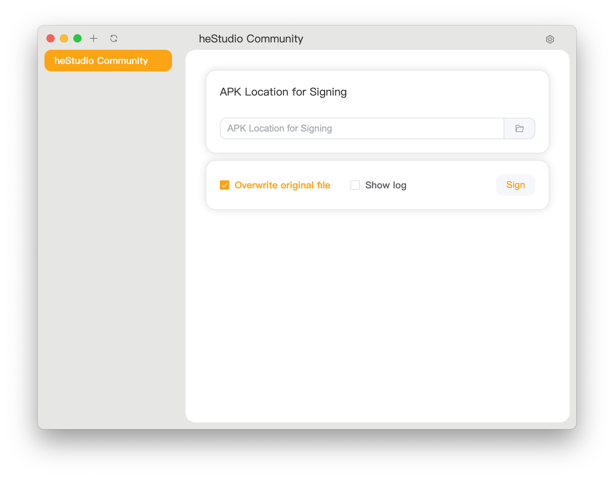

<div align="center">
   
   <h1 style="text-align: center">APKSignerGUI</h1>
   
   <p style="text-align: center">简单又完整的APK签名图形化工具</p>
</div>

---

<div align="center">
   <a href="../../README.md">English</a> | 
   <a href="./README_CN.md">简体中文</a> | 
   <a href="./README_HK.md">繁體中文</a>
</div>

---

### 特点

- **上手简单**: 面向小白用户，只需要导 APK 就可以直接签名。
- **功能完整**: 面向资深用户，提供了谷歌官方提供的所有签名参数支持。
- **兼容性好**: 支持多种操作系统和架构，包括 Windows、Linux、MacOS 等。
- **饼画的圆**: 初期项目，有许多不完善的地方，给大佬们留下足够的扩展空间。

### 如何安装

1. 前往 [Release](https://github.com/hestudio-community/apksigner-gui/releases/latest) 下载最新版本。
2. Windows 用户可以使用 [WinGet](https://learn.microsoft.com/zh-cn/windows/package-manager/winget/) 安装。

   ```powershell
   winget install "heStudioCommunity.APKSignerGUI(Machine-MSI)"
   ```

   当然，你也可以通过 Microsoft Store 下载。

   <a href="https://apps.microsoft.com/detail/9n3q8bk8dp86?mode=direct">
   
   </a>

3. 参考文末方式构建。

### 关于兼容性

已知支持的平台 (由官方打包并经过测试)：

- **Windows**: Windows 10/11 x86_64 (其中 Windows10 为最新版本), Windows 10/11 ARM64 (其中 Windows10 为最新版本)
- **Linux**: Debian 12 及其衍生版本 x86_64 和 ARM64 平台， RedHat 9.5 及其衍生版本 x86_64 和 ARM64 平台
- **macOS**: 所有采用了 Apple Silicon 的 macOS 10.11 以上设备

其他的平台可能需要你自行编译。

#### 为什么不支持 32 位系统或处理器？

我们认为 32 位系统已经落伍，甚至已经无法维持基本的运作了。很多系统厂商和软件厂商不再提供 32 位应用程序和系统。我们认为你几乎不可能在 32 位系统上完成软件开发，因为很多开发工具或者面向对象已经不支持 32 位系统。如果你仍然使用 32 位系统，我们认为你应该可以通过自己的力量使得这个应用程序运作。

### 如何使用？

1. 打开应用程序后，你应该能看到这样的界面。点击右上角设置开始首次配置。
   
2. 在 `sdk/build-tools/<版本号>`目录中找到 `apksigner` 和 `zipalign`, 然后点击保存。
   
3. 点击左侧空白区域关闭设置，然后点击左上角 `+` 添加密钥。
   
4. 点击右侧空白区域关闭页面，选中左侧的签名，然后开始签名安装包。
   

### 找到你的语言

[](https://crowdin.com/project/apksignergui)

我们致力于向全球用户提供相同的服务和体验，如果愿意为这个项目提供相关翻译，我们将会衷心感谢你。

你可以通过以下两种方法提交翻译:

- 在 [crowdin](https://crowdin.com/project/apksignergui) 平台上提交翻译。
- 通过编辑源代码的 `i18n` 目录下对于语言的文本提交翻译。

没有找到你的语言？同样有两种方法提交你的语言。

- 如果使用 [crowdin](https://crowdin.com/project/apksignergui) 平台，请提交一个 issue，我们将会在平台上预留该语言以提供你进行翻译。
- 你也可以通过复制源代码的 `i18n` 目录下的其中一个你熟知的语言进行翻译，当你提交后，我们将会为你完成剩余操作。

我们要求的语言代码以 [ISO 639-1](https://en.wikipedia.org/wiki/ISO_639-1) 为标准，国家或地区代码以 [ISO 3166-1](https://en.wikipedia.org/wiki/ISO_3166-1) 为标准。

感谢 [Crowdin](https://crowdin.com/) 为本项目提供的开源许可证。

### 如何构建？

1. 安装 [NodeJS 22 LTS](https://nodejs.org/)
2. 使用 `npm install` 安装依赖。
3. 使用 `npm run make` 构建。
4. 在 `./out/make` 目录中取得构建物。

#### macOS

1. 安装 [NodeJS 22 LTS](https://nodejs.org/)
2. 使用 `npm install` 安装依赖。
3. 使用 `npm run make` 构建。
4. 在 `./out/make` 目录中取得构建物。

#### Windows

##### ZIP 打包 (推荐)

1. 安装 [NodeJS 22 LTS](https://nodejs.org/)
2. 使用 `npm install` 安装依赖。
3. 编辑 `forge.config.js`.
   将
   ```javascript
   {
      name: "@electron-forge/maker-wix",
      config: {
        // ...
      },
      platfrom: ["win32"],
   },
   ```
   更换为
   ```javascript
   {
     name: "@electron-forge/maker-zip",
     platfrom: ["win32"],
   }
   ```
4. 使用 `npm run make` 构建。
5. 在 `./out/make` 目录中取得构建物。

##### MSI 打包

1. 安装 [NodeJS 22 LTS](https://nodejs.org/)
2. 使用 `npm install` 安装依赖。
3. 安装 [WiX Toolset v3](https://github.com/wixtoolset/wix3/releases/download/wix3141rtm/wix314-binaries.zip).
4. 配置环境变量到`PATH`.
5. 使用 `npm run make` 构建。
6. 在 `./out/make` 目录中取得构建物。

#### Linux (Debian 及其衍生系统)

1. 安装 [NodeJS 22 LTS](https://nodejs.org/)
2. 使用 `npm install` 安装依赖。
3. 安装构建依赖
   ```shell
   sudo apt install fakeroot rpm
   ```
   或者
   ```shell
   sudo apt install fakeroot rpm-build
   ```
4. 使用 `npm run make` 构建。
5. 在 `./out/make` 目录中取得构建物。
