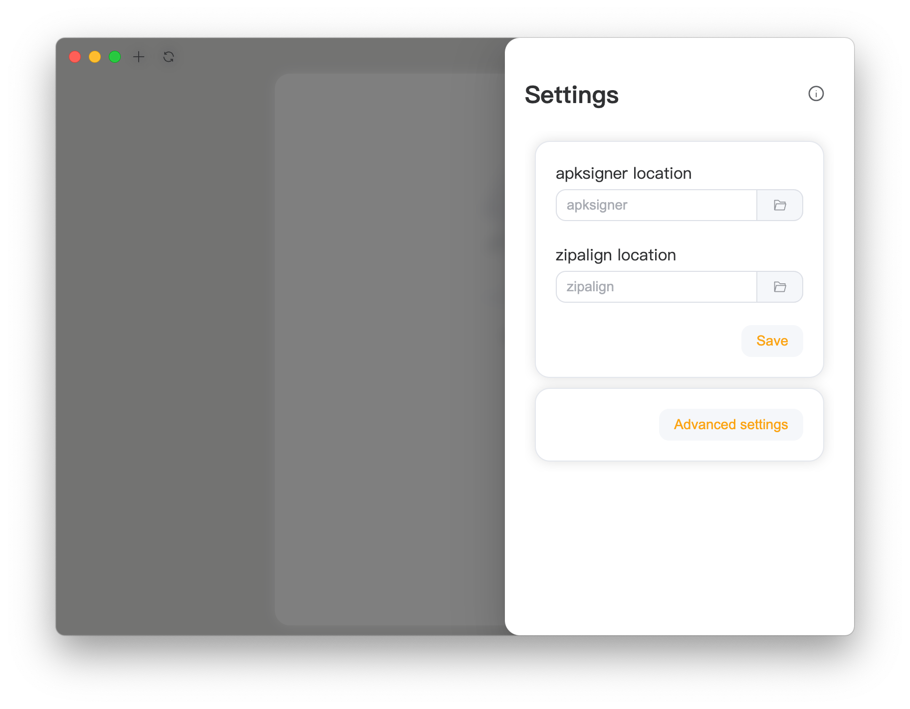

<div align="center">
   
   <h1 style="text-align: center">APKSignerGUI</h1>
   
   <p style="text-align: center">簡單又完整的APK簽名圖形化工具</p>
</div>

---

<div align="center">
   <a href="../../README.md">English</a> | 
   <a href="./README_CN.md">简体中文</a> | 
   <a href="./README_HK.md">繁體中文</a>
</div>

---

### 特點

- **上手簡單**: 面向小白用戶，只需要導 APK 就可以直接簽名。
- **功能完整**: 面向資深用戶，提供了谷歌官方提供的所有簽名參數支持。
- **兼容性好**: 支持多種操作系統和架構，包括 Windows、Linux、MacOS 等。
- **餅畫的圓**: 初期項目，有許多不完善的地方，給大佬們留下足夠的擴展空間。

### 如何安裝

1. 前往 [Release](https://github.com/hestudio-community/apksigner-gui/releases/latest) 下載最新版本。
2. Windows 用戶可以使用 [WinGet](https://learn.microsoft.com/zh-cn/windows/package-manager/winget/) 安裝。

   ```powershell
   winget install "heStudioCommunity.APKSignerGUI(Machine-MSI)"
   ```

   當然，你也可以通過 Microsoft Store 下載，目前，該下載方法僅適用於 `amd64`.

   <a href="https://apps.microsoft.com/detail/9n3q8bk8dp86?mode=direct">
   
   </a>

3. 參考文末方式構建。

### 關於兼容性

已知支持的平台 (由官方打包並經過測試)：

- **Windows**: Windows 10/11 x86_64 (其中 Windows10 為最新版本), Windows 10/11 ARM64 (其中 Windows10 為最新版本)
- **Linux**: Debian 12 及其衍生版本 x86_64 和 ARM64 平台， RedHat 9.5 及其衍生版本 x86_64 和 ARM64 平台
- **macOS**: 所有採用了 Apple Silicon 的 macOS 10.11 以上設備

其他的平台可能需要你自行編譯。

#### 為什麼不支持 32 位系統或處理器？

我們認為 32 位系統已經落伍，甚至已經無法維持基本的運作了。很多系統廠商和軟件廠商不再提供 32 位應用程序和系統。我們認為你幾乎不可能在 32 位系統上完成軟件開發，因為很多開發工具或者面向對象已經不支持 32 位系統。如果你仍然使用 32 位系統，我們認為你應該可以通過自己的力量使得這個應用程序運作。

### 如何使用？

1. 打開應用程序後，你應該能看到這樣的界面。點擊右上角設置開始首次配置。
   
2. 在 `sdk/build-tools/<版本號>`目錄中找到 `apksigner` 和 `zipalign`, 然後點擊保存。
   
3. 點擊左側空白區域關閉設置，然後點擊左上角 `+` 添加密鑰。
   
4. 點擊右側空白區域關閉頁面，選中左側的簽名，然後開始簽名安裝包。
   

### 找到你的語言

[](https://crowdin.com/project/apksignergui)

我們致力於向全球用戶提供相同的服務和體驗，如果願意為這個項目提供相關翻譯，我們將會衷心感謝你。

你可以通過以下兩種方法提交翻譯:

- 在 [crowdin](https://crowdin.com/project/apksignergui) 平台上提交翻譯。
- 通過編輯源代碼的 `i18n` 目錄下對於語言的文本提交翻譯。

沒有找到你的語言？同樣有兩種方法提交你的語言。

- 如果使用 [crowdin](https://crowdin.com/project/apksignergui) 平台，請提交一個 issue，我們將會在平台上預留該語言以提供你進行翻譯。
- 你也可以通過複製源代碼的 `i18n` 目錄下的其中一個你熟知的語言進行翻譯，當你提交後，我們將會為你完成剩餘操作。

我們要求的語言代碼以 [ISO 639-1](https://en.wikipedia.org/wiki/ISO_639-1) 為標準，國家或地區代碼以 [ISO 3166-1](https://en.wikipedia.org/wiki/ISO_3166-1) 為標準。

感謝 [Crowdin](https://crowdin.com/) 為本項目提供的開源許可證。

### 如何構建？

1. 安裝 [NodeJS 22 LTS](https://nodejs.org/)
2. 使用 `npm install` 安裝依賴。
3. 使用 `npm run make` 構建。
4. 在 `./out/make` 目錄中取得構建物。

#### macOS

1. 安裝 [NodeJS 22 LTS](https://nodejs.org/)
2. 使用 `npm install` 安裝依賴。
3. 使用 `npm run make` 構建。
4. 在 `./out/make` 目錄中取得構建物。

#### Windows

##### ZIP 打包 (推薦)

1. 安裝 [NodeJS 22 LTS](https://nodejs.org/)
2. 使用 `npm install` 安裝依賴。
3. 編輯 `forge.config.js`.
   將
   ```javascript
   {
      name: "@electron-forge/maker-wix",
      config: {
        // ...
      },
      platfrom: ["win32"],
   },
   ```
   更換為
   ```javascript
   {
     name: "@electron-forge/maker-zip",
     platfrom: ["win32"],
   }
   ```
4. 使用 `npm run make` 構建。
5. 在 `./out/make` 目錄中取得構建物。

##### MSI 打包

1. 安裝 [NodeJS 22 LTS](https://nodejs.org/)
2. 使用 `npm install` 安裝依賴。
3. 安裝 [WiX Toolset v3](https://github.com/wixtoolset/wix3/releases/download/wix3141rtm/wix314-binaries.zip).
4. 配置環境變量到`PATH`.
5. 使用 `npm run make` 構建。
6. 在 `./out/make` 目錄中取得構建物。

#### Linux (Debian 及其衍生系統)

1. 安裝 [NodeJS 22 LTS](https://nodejs.org/)
2. 使用 `npm install` 安裝依賴。
3. 安裝構建依賴
   ```shell
   sudo apt install fakeroot rpm
   ```
   或者
   ```shell
   sudo apt install fakeroot rpm-build
   ```
4. 使用 `npm run make` 構建。
5. 在 `./out/make` 目錄中取得構建物。
