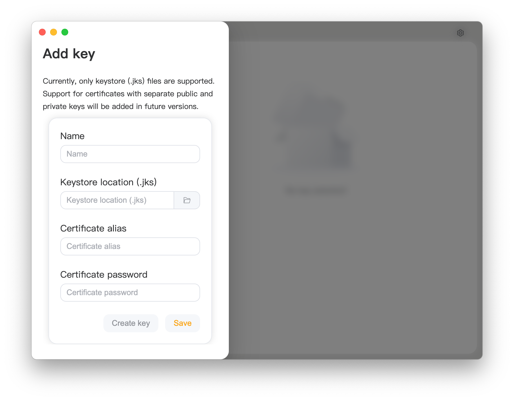

<div align="center">
   
   <h1 style="text-align: center">APKSignerGUI</h1>
   
   <p style="text-align: center">簡單又完整的 APK 簽名圖形化工具</p>
</div>

---

### 特點

- **上手簡單**：面向新手用戶，只需要導入 APK 就可以直接簽名。
- **功能完整**：面向進階用戶，提供了 Google 官方提供的所有簽名參數支持。
- **兼容性佳**：支持多種作業系統和架構，包括 Windows、Linux、macOS 等。
- **可擴充性高**：初期項目，仍有許多可優化之處，為開發者提供足夠的擴展空間。

### 如何安裝

1. 前往 [Release](https://github.com/hestudio-community/apksigner-gui/releases/latest) 下載最新版本。
2. Windows 用戶可使用 [WinGet](https://learn.microsoft.com/zh-tw/windows/package-manager/winget/) 安裝：
   ```powershell
   winget install "heStudioCommunity.APKSignerGUI(Machine-MSI)"
   ```
3. 可參考文末的方法自行構建。

### 兼容性說明

目前已知支持的作業平台（官方打包並測試過）：

- **Windows**：Windows 10/11 x86_64（Windows 10 為最新版本）、Windows 10/11 ARM64（Windows 10 為最新版本）
- **Linux**：Debian 12 及其衍生版本 x86_64 和 ARM64 平台，RedHat 9.5 及其衍生版本 x86_64 和 ARM64 平台
- **macOS**：所有搭載 Apple Silicon 的 macOS 10.11 以上設備

其他平台可能需要自行編譯。

#### 為何不支援 32 位元系統或處理器？

我們認為 32 位元系統已經過時，甚至無法維持基本運作。許多作業系統與軟體開發商已經不再提供 32 位元應用程式與系統。我們認為，在 32 位元系統上完成軟體開發幾乎是不可能的，因為許多開發工具或目標平台已經不再支持 32 位元系統。如果您仍然使用 32 位元系統，我們相信您有能力自行讓這個應用程式運行。

### 如何使用？

1. 開啟應用程式後，您應該會看到以下介面。點擊右上角的設定按鈕進行首次設定。
   
2. 在 `sdk/build-tools/<版本號>` 目錄中找到 `apksigner` 和 `zipalign`，然後點擊保存。
   
3. 點擊左側空白區域關閉設定，然後點擊左上角 `+` 新增密鑰。
   
4. 點擊右側空白區域關閉頁面，選擇左側的簽名選項，然後開始簽名 APK。
   

### 找到您的語言

[](https://crowdin.com/project/apksignergui)

我們致力於為全球用戶提供相同的服務與體驗。如果您願意為此專案提供翻譯，我們將衷心感謝您的貢獻。

您可以透過以下方式提交翻譯：

- 在 [Crowdin](https://crowdin.com/project/apksignergui) 平台上提交翻譯。
- 直接編輯原始碼 `i18n` 目錄中的語言文件並提交翻譯。

如果沒有找到您的語言，您可以透過以下方式提交您的語言：

- 如果使用 [Crowdin](https://crowdin.com/project/apksignergui) 平台，請提交一個 issue，我們會在平台上新增該語言以供翻譯。
- 您也可以複製 `i18n` 目錄下的其中一個已翻譯的語言文件進行翻譯，提交後我們會幫您處理後續工作。

我們的語言代碼標準遵循 [ISO 639-1](https://zh.wikipedia.org/wiki/ISO_639-1)，國家或地區代碼遵循 [ISO 3166-1](https://zh.wikipedia.org/wiki/ISO_3166-1)。

### 如何構建？

1. 安裝 [NodeJS 22 LTS](https://nodejs.org/)
2. 使用 `npm install` 安裝依賴。
3. 使用 `npm run make` 進行構建。
4. 在 `./out/make` 目錄中獲取構建產物。

#### macOS

1. 安裝 [NodeJS 22 LTS](https://nodejs.org/)
2. 使用 `npm install` 安裝依賴。
3. 使用 `npm run make` 進行構建。
4. 在 `./out/make` 目錄中獲取構建產物。

#### Windows

##### ZIP 打包（推薦）

1. 安裝 [NodeJS 22 LTS](https://nodejs.org/)
2. 使用 `npm install` 安裝依賴。
3. 編輯 `forge.config.js`，將：
   ```javascript
   {
      name: "@electron-forge/maker-wix",
      config: {
        // ...
      },
      platform: ["win32"],
   },
   ```
   更換為：
   ```javascript
   {
     name: "@electron-forge/maker-zip",
     platform: ["win32"],
   }
   ```
4. 使用 `npm run make` 進行構建。
5. 在 `./out/make` 目錄中獲取構建產物。

##### MSI 打包

1. 安裝 [NodeJS 22 LTS](https://nodejs.org/)
2. 使用 `npm install` 安裝依賴。
3. 安裝 [WiX Toolset v3](https://github.com/wixtoolset/wix3/releases/download/wix3141rtm/wix314-binaries.zip)。
4. 配置 `PATH` 環境變數。
5. 使用 `npm run make` 進行構建。
6. 在 `./out/make` 目錄中獲取構建產物。

#### Linux（Debian 及其衍生系統）

1. 安裝 [NodeJS 22 LTS](https://nodejs.org/)
2. 使用 `npm install` 安裝依賴。
3. 安裝構建依賴：
   ```shell
   sudo apt install fakeroot rpm
   ```
   或者
   ```shell
   sudo apt install fakeroot rpm-build
   ```
4. 使用 `npm run make` 進行構建。
5. 在 `./out/make` 目錄中獲取構建產物。
